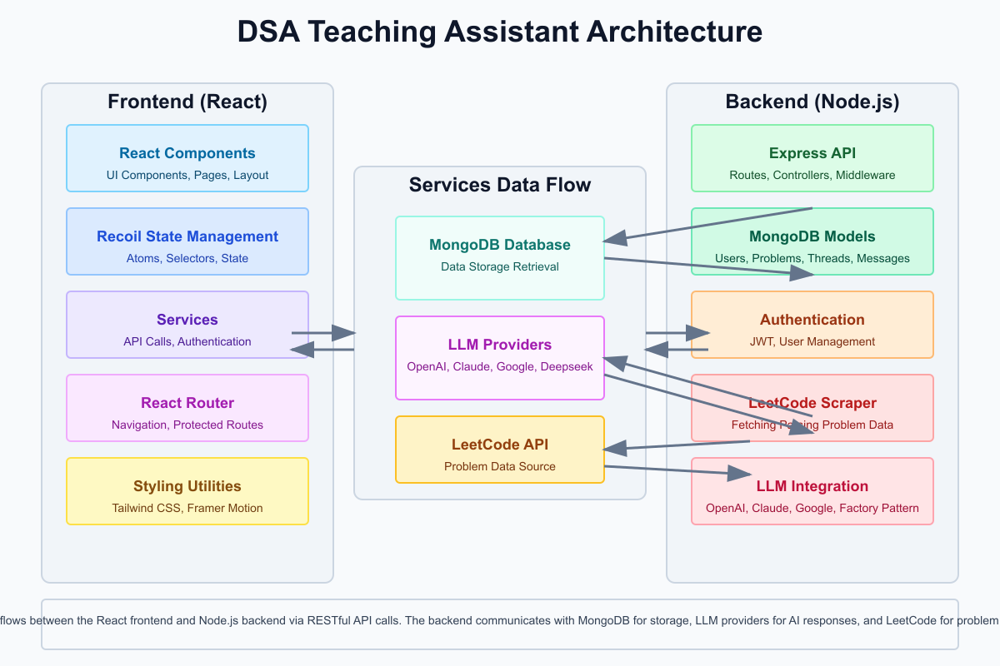

# DSA Teaching Assistant

A full-stack application designed to help users learn data structures and algorithms by providing an AI-powered teaching assistant for LeetCode problems.

# Live Demo : https://muse-kan2.onrender.com/
## email : amriteshindal29@gmail.com
## password: 123456

## Overview

The DSA Teaching Assistant is an interactive platform that combines LeetCode problems with AI guidance. This application helps users learn data structures and algorithms by providing:

- LeetCode problem import and management
- AI-powered conversation threads specific to each problem
- Support for multiple LLM providers (OpenAI, Google, Anthropic, etc.)
- A polished, responsive UI designed for learning

The application consists of two main components:
- **Client**: React frontend with Tailwind CSS
- **Server**: Node.js backend with Express and MongoDB

## Table of Contents

- [Architecture Overview](#architecture-overview)
- [Client Setup](#client-setup)
- [Server Setup](#server-setup)
- [Using the Application](#using-the-application)
- [AI Integration](#ai-integration)
- [Technical Details](#technical-details)

## Architecture Overview

<div align="center">
  
</div>

### High-Level Architecture

1. **Frontend (React)**
   - Modern UI built with React, Tailwind CSS, and Framer Motion
   - State management using Recoil
   - Responsive design for desktop and mobile

2. **Backend (Node.js/Express)**
   - RESTful API for managing problems, threads, and conversations
   - Authentication system with JWT
   - LeetCode problem scraping and management
   - AI integration with multiple LLM providers

3. **Database (MongoDB)**
   - User data storage
   - Problem details caching
   - Conversation threads and messages

4. **AI Integration**
   - Factory pattern for multiple LLM providers
   - Context-aware prompting system
   - Conversation history management

## Client Setup

### Prerequisites

- Node.js (v16 or higher)
- npm or yarn

### Installation

1. Clone the repository:
   ```bash
   git clone https://github.com/looper12349/muse
   cd muse
   cd client
   ```

2. Install dependencies:
   ```bash
   npm install
   # or
   yarn install
   ```

3. Create a `.env` file in the client directory with:
   ```
   VITE_API_URL=http://localhost:5000/api
   ```

4. Start the development server:
   ```bash
   npm run dev
   # or
   yarn dev
   ```

The client application will run at `http://localhost:5173`.

## Project Structure

```
src/
├── components/
│   ├── auth/
│   │   ├── LoginForm.jsx
│   │   └── RegisterForm.jsx
│   ├── common/
│   │   ├── Button.jsx
│   │   ├── Input.jsx
│   │   ├── Loader.jsx
│   │   └── Modal.jsx
│   ├── layout/
│   │   ├── AppLayout.jsx
│   │   ├── Sidebar.jsx
│   │   └── MobileNav.jsx
│   ├── problem/
│   │   ├── ProblemCard.jsx
│   │   ├── ProblemDisplay.jsx
│   │   └── ProblemForm.jsx
│   └── thread/
│       ├── ChatMessage.jsx
│       ├── MessageComposer.jsx
│       ├── ThreadHeader.jsx
│       ├── ThreadItem.jsx
│       └── ThreadList.jsx
├── lib/
│   ├── aceternity-ui/
│   │   ├── animations.jsx
│   │   ├── button-effects.jsx
│   │   └── card-hover.jsx
├── pages/
│   ├── Auth.jsx
│   ├── Home.jsx
│   ├── Problems.jsx
│   └── Thread.jsx
├── recoil/
│   ├── atoms/
│   │   ├── authAtom.js
│   │   ├── problemAtom.js
│   │   └── threadAtom.js
│   └── selectors/
│       ├── authSelectors.js
│       ├── problemSelectors.js
│       └── threadSelectors.js
├── services/
│   ├── authService.js
│   ├── problemService.js
│   └── threadService.js
├── styles/
│   └── globals.css
├── utils/
│   ├── api.js
│   ├── constants.js
│   ├── localStorage.js
│   └── tokenManager.js
├── App.jsx
└── index.jsx
```

### Client Structure

- **src/components**: UI components organized by feature and common elements
- **src/pages**: Main application pages (Auth, Home, Problems, Thread)
- **src/services**: API service modules for communicating with the backend
- **src/utils**: Utility functions and constants
- **src/recoil**: State management with Recoil atoms and selectors
- **src/lib**: Third-party libraries and component extensions

### Technologies Used

- **React**: UI library
- **React Router**: Navigation
- **Recoil**: State management
- **Axios**: API requests
- **Tailwind CSS**: Styling
- **Framer Motion**: Animations
- **Lucide React**: Icon library
- **React Markdown**: Markdown rendering

## Server Setup

### Prerequisites

- Node.js (v16 or higher)
- MongoDB (local instance or MongoDB Atlas)
- API keys for LLM providers

### Installation

1. Navigate to the server directory:
   ```bash
   cd muse/server
   ```

2. Install dependencies:
   ```bash
   npm install
   # or
   yarn install
   ```

3. Create a `.env` file in the server directory with:
   ```
   # Server Configuration
    PORT=5000
    NODE_ENV=development

    # Database
    MONGO_URI=mongo_url

    # JWT
    JWT_SECRET=JWT_SECRET_KEY
    JWT_EXPIRE=30d

    # Default LLM Configuration
    DEFAULT_LLM_PROVIDER=openai  # 'openai', 'google', 'claude', or 'deepseek'

    # OpenAI Configuration
    OPENAI_API_KEY=your_openai_api_key_here
    OPENAI_MODEL=gpt-4o  # Default model for OpenAI

    # Google Configuration
    GOOGLE_API_KEY=API_KEY
    GOOGLE_MODEL=gemini-2.0-flash  # Default model for Google

    # Anthropic (Claude) Configuration
    ANTHROPIC_API_KEY=your_anthropic_api_key_here
    CLAUDE_MODEL=claude-3-opus-20240229  # Default model for Claude

    # Deepseek Configuration
    DEEPSEEK_API_KEY=your_deepseek_api_key_here
    DEEPSEEK_MODEL=deepseek-coder  # Default model for Deepseek

    # Feature Flags
    ENABLE_LLM_SWITCHING=true  # Allow users to switch between LLM providers
    ENABLE_MODEL_SELECTION=true  # Allow users to select specific models for each provider
   ```

4. Start the server:
   ```bash
   npm run dev
   # or
   yarn dev
   ```

The server will run at `http://localhost:5000`.


## Project Structure

```

├── server/
│   ├── config/
│   │   ├── db.js
│   │   ├── env.js
│   │   └── llmConfig.js
│   ├── controllers/
│   │   ├── authController.js
│   │   ├── problemController.js
│   │   └── threadController.js
│   ├── middleware/
│   │   ├── authMiddleware.js
│   │   ├── errorMiddleware.js
│   │   └── requestLogger.js
│   ├── models/
│   │   ├── Problem.js
│   │   ├── Thread.js
│   │   ├── Message.js
│   │   └── User.js
│   ├── routes/
│   │   ├── authRoutes.js
│   │   ├── problemRoutes.js
│   │   └── threadRoutes.js
│   ├── services/
│   │   ├── llmService.js
│   │   ├── problemService.js
│   │   └── threadService.js
│   ├── utils/
│   │   ├── apiResponse.js
│   │   ├── asyncHandler.js
│   │   ├── promptBuilder.js
│   │   └── validation.js
│   ├── app.js
│   ├── server.js
│   ├── package.json
│   └── .env
│
├── package.json
└── README.md
```

### API Endpoints


- `POST /api/auth/register` - Register a new user
- `POST /api/auth/login` - Login and get JWT token
- `GET /api/auth/me` - Get current user details

### Problems

- `POST /api/problems` - Submit a LeetCode URL to create a problem
- `GET /api/problems/:id` - Get problem details by ID

### Threads

- `POST /api/threads` - Create a new conversation thread for a problem
- `GET /api/threads` - Get all threads for the current user
- `GET /api/threads/:id` - Get a specific thread with messages
- `POST /api/threads/:id/messages` - Send a message in a thread and get AI response


## Using the Application

### Authentication

1. Register a new account or log in with existing credentials
2. The app will automatically authenticate and redirect to the home page

### Managing Problems

1. Navigate to the "Problems" page
2. To add a new problem:
   - Click "Add Problem"
   - Enter a valid LeetCode problem URL
   - The system will scrape and store the problem details
3. Browse existing problems using the filter options:
   - Search by keyword
   - Filter by difficulty (Easy, Medium, Hard)
   - Filter by algorithm tags (Array, String, DP, etc.)
4. Click on a problem to view its details

### Starting Conversations

1. Select a problem from the list
2. Click "Start Thread" to create a new conversation
3. The system will create a thread specific to that problem

### Using the AI Assistant

1. In a thread, use the message composer to ask questions
2. The AI will respond with guidance related to the problem:
   - Conceptual explanations
   - Algorithm suggestions
   - Step-by-step problem-solving approaches
   - Hints without direct solutions
3. Continue the conversation to develop a deeper understanding

### Switching LLM Providers

1. In an active thread, click the menu (three dots) in the thread header
2. Select "Change Model"
3. Choose from available LLM providers:
   - OpenAI GPT-4
   - Anthropic Claude
   - Google Gemini
   - Cohere Command

## AI Integration

### Prompt Engineering

The system uses a carefully designed prompting strategy to ensure that the AI serves as a teaching assistant rather than a solution provider. The prompts instruct the LLM to:

1. Guide users through problem-solving approaches
2. Break down complex problems into manageable steps
3. Use the Socratic method to lead users to their own understanding
4. Provide relevant examples and hints
5. Identify edge cases and optimization opportunities
6. Avoid providing direct, complete solutions

### LLM Factory Pattern

The server implements a factory pattern for LLM integration, allowing:

1. **Provider Abstraction**: Common interface for all LLM providers
2. **Easy Switching**: Seamless switching between different LLMs
3. **Fault Tolerance**: Fallback mechanisms if a provider fails
4. **Caching**: Response caching to reduce API costs

### LLM Provider Integration

The system supports multiple LLM providers:

1. **OpenAI GPT-4**:
   - Default provider
   - Uses the Chat Completions API
   - Supports various GPT models (gpt-4o, gpt-4-turbo, gpt-3.5-turbo)

2. **Google Gemini**:
   - Alternative provider
   - Supports Gemini Pro and Gemini Ultra models

3. **Anthropic Claude**:
   - Alternative provider
   - Supports Claude 3 models (Opus, Sonnet, Haiku)

4. **Deepseek**:
   - Experimental provider
   - Specialized for code understanding

### Context Management

The system maintains conversation context by:

1. Storing all messages for each thread
2. Including problem details and relevant conversation history in each prompt
3. Formatting prompts appropriately for each LLM provider
4. Maintaining separate conversation threads for different problems

## Technical Details

### LeetCode Problem Scraping

The system uses a robust scraping mechanism to extract problem details:

1. **Multiple Methods**:
   - GraphQL API requests (primary method)
   - HTTP requests with cheerio parsing
   - Headless browser with Puppeteer (fallback)

2. **Rate Limiting and Caching**:
   - In-memory cache for frequently accessed problems
   - Configurable request delays to avoid rate limiting
   - Error handling and retry mechanisms

3. **Data Extraction**:
   - Problem title and ID
   - Difficulty level
   - Problem description (HTML)
   - Algorithm tags
   - LeetCode URL

### Security Considerations

1. **Authentication**:
   - JWT-based authentication
   - Password hashing with bcrypt
   - Token expiration and validation

2. **API Security**:
   - Request validation
   - Rate limiting
   - CORS configuration

3. **Data Protection**:
   - Input sanitization
   - Error handling that doesn't expose sensitive information
   - Proper environment variable usage

### Performance Optimizations

1. **Frontend**:
   - Optimized React rendering
   - Code splitting and lazy loading
   - Efficient state management with Recoil

2. **Backend**:
   - Database indexing for frequent queries
   - Caching mechanisms for LeetCode problem data
   - Efficient prompt construction to minimize token usage

3. **AI Integration**:
   - Response caching
   - Fallback mechanisms when providers fail
   - Optimized prompt design to reduce token usage

## License

MIT

## Acknowledgments

- LeetCode for providing the problem repository
- OpenAI, Google, and Anthropic for their LLM APIs
- The open-source community for the amazing libraries and tools
